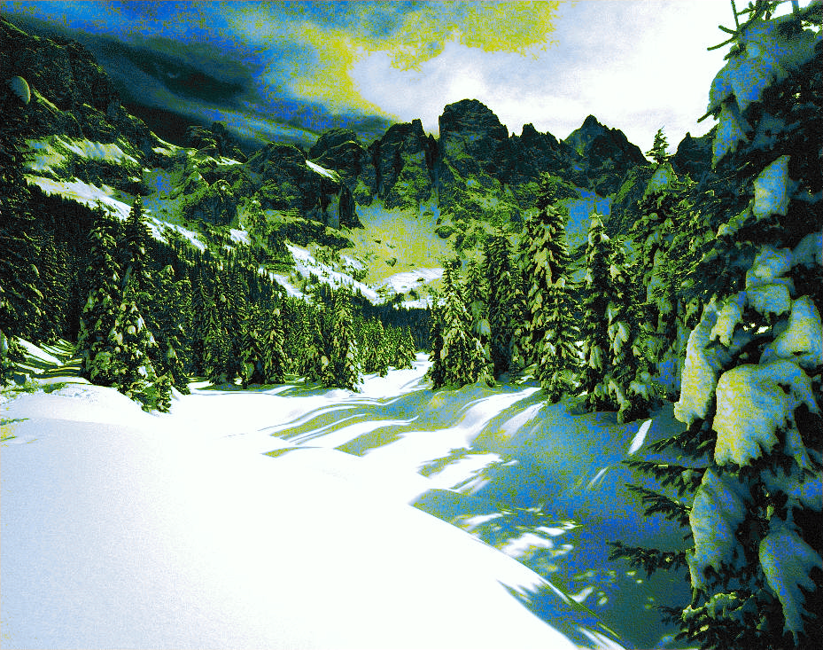
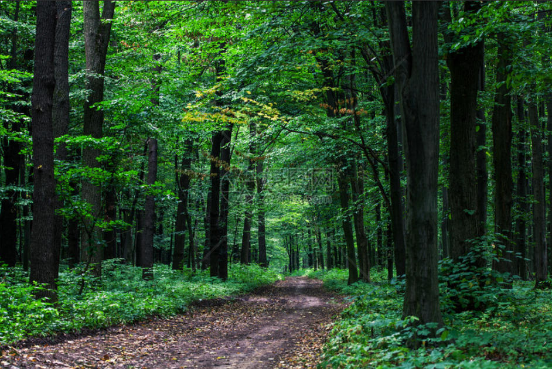
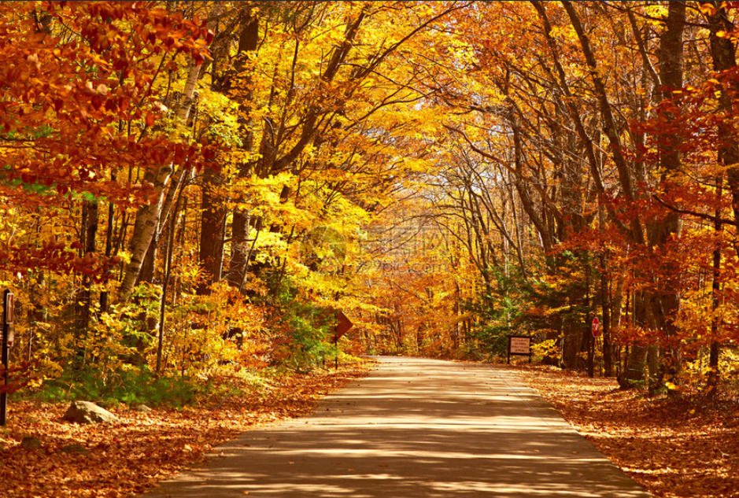
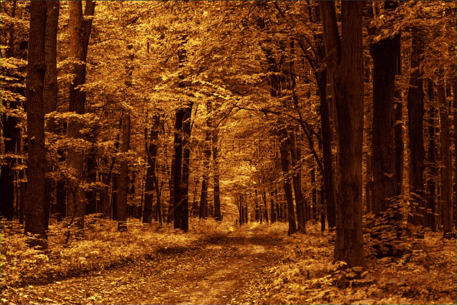

# KNN 颜色迁移 (KNN Color Transfer)

基于 K-近邻算法的颜色风格迁移工具，可以将一张图片的颜色风格迁移到另一张图片上。

## 项目简介

本项目实现了基于 KNN（K-Nearest Neighbors）算法的颜色迁移方法：

**高级 KNN 颜色迁移** (`advanced_knn_matcher.py`)：

- 使用窗口级别的特征进行匹配（考虑周围像素信息）
- 可调节窗口大小，提供更好的迁移效果

## 目录结构

```
knn_color_transfer/
├── data/
│   ├── source/           # 源图像目录
│   ├── reference/        # 参考图像目录
│   └── output/           # 输出图像目录
├── src/
│   ├── advanced_knn_matcher.py # 高级 KNN 匹配器
│   ├── color_utils.py         # 颜色空间转换工具
│   └── __init__.py
├── advanced_main.py     # 高级颜色迁移入口
├── README.md            # 项目说明文档
└── __init__.py          # Python包初始化文件
```

## 使用方法

### 高级颜色迁移

```bash
python advanced_main.py [--source SOURCE_PATH] [--reference REF_PATH] [--output OUTPUT_PATH] [-k K] [--sigma SIGMA] [--window-size SIZE]
```

额外参数：

- `--window-size`: 窗口大小（1 表示 3x3 窗口，2 表示 5x5 窗口等）

示例：

```bash
python advanced_main.py --source data/source/730x576x2.jpg --reference data/reference/boat.jpg --output data/output/advanced_result.png --window-size 2
```

使用夏季森林和秋季森林图像的示例：

```bash
python advanced_main.py --source data/source/SummerForest.jpg --reference data/reference/AutumnForest.jpg --output data/output/advanced_transferred_image3.png --window-size 2
```

## 算法原理

### 高级 KNN 方法

1. 不仅考虑单个像素的颜色值，还考虑其周围窗口内的亮度信息
2. 使用滑动窗口提取特征，使得匹配更加符合人眼感知
3. 通过调整窗口大小来控制考虑的上下文范围

## 参数调优建议

- **K 值**：较小的 K 值会产生更接近参考图像的效果，但可能引入噪声；较大的 K 值会产生更平滑的结果，但可能丢失细节。推荐值：5-20。
- **Sigma 值**：控制高斯权重的衰减速度。较小的 Sigma 值使距离近的邻居权重更大，较大则权重分布更均匀。推荐值：30-100。
- **窗口大小**（仅高级方法）：控制考虑上下文信息的范围。值越大，迁移效果越全局化，但也可能丢失局部特征。推荐值：1-3。

## 示例结果

| 源图像                                  | 参考图像                                     | 迁移结果                                             |
| --------------------------------------- | -------------------------------------------- | ---------------------------------------------------- |
|     |          |   |
|     |         |  |
|  |  |  |

## 注意事项

1. 输入图像格式支持常见的 JPG、PNG 等格式
2. 输出图像默认保存为 PNG 格式以保证质量
3. 处理大尺寸图像时可能需要较长时间，请耐心等待
4. 如果遇到内存不足问题，可尝试减小 K 值或使用较小尺寸的图像

## 许可证

MIT License

## 贡献者

该项目由机器学习爱好者开发，欢迎提出改进建议和贡献代码。
